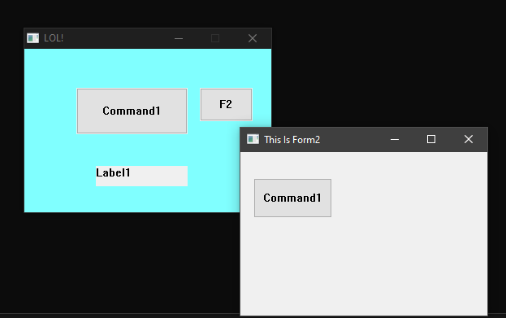
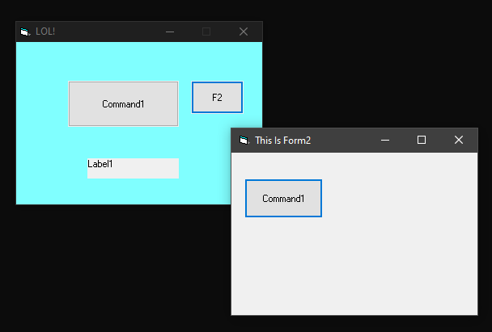

# What is this?
This is an open source interpretation of what the MSVBVM60 library does. Such library is used in VB6 applications as a base-library, where most VB functions are implemented.

# Why?
Well, there's no need to do this, but since VB6 is getting outdated, an open source runtime library might add some years to VB6's lifespan.

# Screenshots
The same compiled VB6 test app (two forms, a `CommandButton`, a `Label`), run against this project's `openmsvbvm.dll` (left) versus the real, original `msvbvm60.dll` (right):

| openmsvbvm | original msvbvm60.dll |
| --- | --- |
|  |  |

# How we did this?
Since the source code of this library is not available, and reverse engineering the library is a no-go, we've used some tools to get the information we need.
For instance, IDA was used against a dummy VB6 .exe file where the target function was called.
API Monitor from ROHITAB was also used to check some runtime values and function calls from the original MSVBVM60.dll.
Some reverse-engineering sites such as the ones listed in http://sandsprite.com/vb-reversing/

# How to contribute
In order to contribute, please clone this repo, build it, and after you can run the example VB6 project, you can start adding new functionality.
To do so, try to add a test in the dummy VB6 project and check if that doesn't work against this library. Normally these kind of errors are related to missing exported functions, so, it's easy to check what the original library did (using the methods described before).
After the functionality is implemented, create a pull request.

# Compiling the sources
You'll need Visual Studio 2026 to compile the `MSVBVM60.DLL` library. Just open the solution and build it (either Debug or Release).

An example VB6 project is located inside the `Debug` folder. In order to compile it, you'll need VB6 installed. Compile the .exe of that project inside the Debug folder, and run it from either opening it directly from Explorer, or from "Run" in Visual Studio (launch configuration will open the VB6 project, and you can add debug the library from there).

## Building and debugging with VS Code
The repo ships a `.vscode` folder (Visual Studio and VS Code can be used side by side against the same checkout, no conflict) with everything wired up already:

* Install the recommended `ms-vscode.cpptools` extension when prompted (or install it manually) -- it provides the C++ debugger and IntelliSense (`c_cpp_properties.json` is already configured for the Debug/Release x86 configurations).
* **Build** (`Ctrl+Shift+B`, or Terminal > Run Task) offers `Build (Debug|Win32)` (the default), `Build (Release|Win32)`, `Clean (Debug|Win32)`, and `Build VB6 test app (Proyecto1.exe)` (invokes the real `VB6.EXE` against `Debug\Proyecto1.vbp`, so VB6 still needs to be installed for that one). These call `MSBuild.exe` against `openmsvbvm.sln` directly, and the build's own post-build step already copies the resulting `msvbvm60.dll`/`.pdb` straight into the repo-root `Debug` folder, so no manual copy step is needed.
* **Debug** (`F5`) runs the `Debug openmsvbvm (VB6 test app)` launch configuration: it builds via the task above, then launches `Debug\Proyecto1.exe` under the native (`cppvsdbg`) debugger, so breakpoints set anywhere in the DLL's C++ sources hit as soon as the VB6 test app calls into them.

# Status of the library
This library IS NOT A FULL replacement of the original library. So, don't expect to be a drop-in replacement.

Currently, a small subset of the original library are implemented.
Most notable ones:

* Arrays
    * Internal functions (`__vbaGenerateBoundsError`, `__vbaAryLock`, `__vbaAryUnlock`, `__vbaAryConstruct2`, `__vbaErase`, `__vbaAryDestruct`) ✅
    * `LBound` (`__vbaLbound`) ✅
    * `UBound` (`__vbaUbound`) ✅
    * `ReDim Preserve` (`__vbaRedimPreserve`) ✅
    * `ReDim` (`__vbaRedim`) ✅
* Command Line
    * `Command` either for `VARIANTARG` or `BSTR` (`rtcCommandBstr` and `rtcCommandVar`) ✅
    * Setting the value of `Command` variable (`rtcSetCommandLine`) ✅
* Date and Time
    * `Now` (`rtcGetPresentDate`) ✅
    * Conversion from `VARIANTARG` to ``DATE` ✅
* * Exceptions
    * `On Error Goto xxxx` and `On Error Resume Next` statements are supported (`vbaOnError`) ✅
    * `Err` object not supported. ❌
    * Handling of the exceptions through SEH ✅
    * Growing and zeroing stack on functions prologue (`__vbaChkStk`) ✅
* File Interaction
    * All of these functions are wrapped in a class.
    * `Open` (`__vbaFileOpen`) ✅
    * `Close` (`__vbaFileClose`) ✅
    * `LOF` (`rtcFileLength`) ✅
    * `Seek` (`__vbaFileSeek`) ✅
    * `Get` (`__vbaGet3`) ✅
    * `Put` (`__vbaPut3`) ✅
* Floating Point
    * `__adj_fdiv_m16i` ❌ (stub)
    * `__adj_fdiv_m32` ❌ (stub)
    * `__adj_fdiv_m32i` ❌ (stub)
    * `__adj_fdiv_m64` ❌ (stub)
    * `__adj_fdiv_r` ❌ (stub)
    * `__adj_fdivr_m16i` ❌ (stub)
    * `__adj_fdivr_m32` ❌ (stub)
    * `__adj_fdivr_m32i` ❌ (stub)
    * `__adj_fdivr_m64` ❌ (stub)
    * `__adj_fprem` ❌ (stub)
    * `__adj_fprem1` ❌ (stub)
    * `__CIatan` ❌ (stub)
    * `__CIcos` ❌ (stub)
    * `__CIexp` ❌ (stub)
    * `__CIlog` ❌ (stub)
    * `__CIsin` ❌ (stub)
    * `__CIsqrt` ❌ (stub)
    * `__CItan` ❌ (stub)
    * `___vbaCyMul` ✅
    * `__allmul	` ✅
    * `___vbaFpI2` ❌ (stub)
    * `__vbaUI1I2` ✅
    * `_adj_fptan` ✅
    * `_adj_fpatan` ✅
* Forms and Controls
    * Showing a Form, modal or modeless (`Show`) ✅
        * `vbModal` actually disables the real owner window while the modal message loop runs.
    * `Form_Load` / `Form_QueryUnload` events ✅
    * Project startup object set to a Form instead of `Sub Main` ✅
    * `CommandButton`: rendered as a real Win32 button, `Click` event ✅
    * `Label`: rendered as a real Win32 static control, `Click` event ✅
    * Reading placed control properties from code, e.g. `Label1.Caption = Now` (control accessor slots) ✅ (`Name`/`Caption` only so far)
    * Any other control type (`TextBox`, `CheckBox`, etc.) ❌
    * Any other control event (`DblClick`, `MouseDown`, `GotFocus`, ...) ❌
    * `MDIForm` ❌
* `InputBox` (`rtcInputBox`) ✅
* DLL function calls (`DllFunctionCall`) ✅
* Locale (`getUserLocale`) ✅
* `MsgBox` (`rtcMsgBox`) ✅
* Creation of COM objects
    * `New <class>` (`__vbaNew`) ✅
        * Regular classes can be instantiated, with private and public members.
        * `WithEvents` / `RaiseEvent` (class events): real `IConnectionPointContainer`/`IConnectionPoint`-based sink infrastructure exists (`EventDispatch.hpp/.cpp`), but is still experimental and not confirmed reliably working end-to-end yet ⚠️ (disabled in the test project for now).
    * ActiveX objects `CreateObject` (`rtcCreateObject2`) ✅
    * Internal helpers for COM objects (`__vbaObjSet`, `__vbaObjSetAddref`, `__vbaCastObj`, `__vbaObjVar`, `__vbaLateMemCall`, `__vbaVarLateMemCallLdRf`, `__vbaFreeObjList`) ✅
    * `__vbaVarLateMemCallLd` ❌
    * `Set obj = Norhing` (`__vbaFreeObj`) ✅
    * Invocation of methods and properties of COM objects ✅
    * `GetActiveObject` with proper redirects for internal VB objects (VBGlobal, etc.) ✅
* Strings
* Variants
* Access to the VBA object's functions
    * `Activate` (`rtcAppActivate`) ✅
    * `Beep` (`rtcBeep`) ✅
    * `Choose` (`rtcChoose`) ✅
    * `Environ` (`rtcEnviron`) ✅
    * `Iif` (`rtcImmediateIf`) ✅
    * `Partition` (`rtcPartition`) ✅
    * `SendKeys` (`rtcSendKeys`) ❌ (TODO: use [Karl E. Peterson's SendInput](http://www.classicvb.net/samples/SendInput/))
    * `Shell` (`rtcShell`) ✅
* VB global object
    * `App` member object
        * `App.Path` (`get_Path`) ✅
        * `App.EXEName` (`get_EXEName`) ✅
        * `App.Title` (`get_Title`) ✅
        * `App.Major` (`get_Major`) ✅
        * `App.Minor` (`get_Minor`) ✅
        * `App.Revision` (`get_Revision`) ✅
        * `App.Comments` (`get_Comments`) ✅
        * `App.CompanyName` (`get_CompanyName`) ✅
        * `App.FileDescription` (`get_FileDescription`) ✅
        * `App.LegalCopyright` (`get_LegalCopyright`) ✅
        * `App.LegalTrademarks` (`get_LegalTrademarks`) ✅
        * `App.ProductName` (`get_ProductName`) ✅
        * `App.hInstance` (`get_hInstance`) ✅
        * `App.ThreadID` (`get_ThreadID`) ✅
        * All other members are stubbed out ❌

Right now there's NO compatibility with applications that manipulate the internal MSVBVM60.DLL objects, like the ones obtained by calling `TlsGetValue`, or other undocumented APIs (at least at this time).
